# Tradução do Artigo

## From Reports to Bug-Fix Commits: A 10 Years Dataset of Bug-Fixing Activity from 55 Apache’s Open Source Projects
> De relatórios a confirmações de correção de bugs: um conjunto de dados de 10 anos de atividade de correção de bugs de 55 projetos de código aberto do Apache

### Autores

- Renan Vieira (renangomes@lia.ufc.br) Federal University of Ceará - Fortaleza, Ceará, Brazil
- Antônio da Silva (amanciosilva@great.ufc.br) Federal University of Ceará - Fortaleza, Ceará, Brazil
- Lincoln Rocha (lincoln@great.ufc.br) Federal University of Ceará - Fortaleza, Ceará, Brazil
- João Paulo Gomes (jpaulo@lia.ufc.br) Federal University of Ceará - Fortaleza, Ceará, Brazil

## Resumo

Bugs aparecem em quase qualquer desenvolvimento de software. Resolver todos ou pelo menos uma grande parte deles requer muito tempo, esforço e orçamento. Projetos de software normalmente usam sistemas de rastreamento de problemas como uma forma de relatar e monitorar tarefas de correção de bugs. Nos últimos anos, vários pesquisadores têm conduzido análises de rastreamento de bugs para entender melhor o problema e, assim, fornecer meios para reduzir custos e melhorar a eficiência da tarefa de correção de bugs. Neste artigo, apresentamos um novo conjunto de dados composto por mais de 70.000 relatórios de correção de bugs de 10 anos de atividade de correção de bugs de 55 projetos da Apache Software Foundation, distribuídos em 9 categorias. Extraímos essas informações do sistema de rastreamento de problemas do Jira sobre duas perspectivas diferentes de relatórios com status fechado/resolvido: estático (a versão mais recente dos relatórios) e dinâmico (as alterações que ocorreram nos relatórios ao longo do tempo). Também extraímos informações dos commits (se existirem) que corrigem esses bugs de seus respectivos sistemas de controle de versão (Git). Também fornecemos uma análise de alterações que ocorrem nos relatórios como uma forma de ilustrar e caracterizar o conjunto de dados proposto. Como o processo de extração de dados é uma tarefa não trivial e propensa a erros, acreditamos que iniciativas como essa podem ser úteis para dar suporte aos pesquisadores em investigações mais detalhadas.

## 1. INTRODUÇÃO

Os Issue Tracking Systems (ITS), como Jira e Bugzilla, são uma rica fonte de informações sobre desenvolvimento de software. Em tais sistemas, um problema pode descrever coisas diferentes no desenvolvimento de software, que podem ser um bug, uma nova funcionalidade, uma vulnerabilidade de segurança, aprimoramento de funcionalidade existente ou até mesmo uma tarefa de projeto [3]. Em projetos de Open Source Software (OSS), as ferramentas de ITS desempenham um papel importante, funcionando como uma ferramenta de gerenciamento de tarefas e como um canal de comunicação entre as partes interessadas em relação ao ciclo de vida dos problemas.

Assim, pesquisadores e profissionais têm usado informações de ITS para investigar aspectos importantes do processo de desenvolvimento, como estimativa automática de prioridade de bugs [15], identificação de relatórios de bugs duplicados [18], reabertura de problemas fechados [24], o que caracteriza um bug de longa duração [10] e estimativa de esforço de correção de bugs [1, 19].

Bugs em projetos de OSS são muito comuns. Infelizmente, a atividade de correção de bugs é uma das tarefas que mais consomem recursos e esse problema é agravado em grandes sistemas de software. Nesses casos, o número de relatórios de bugs pode exceder os recursos disponíveis do projeto [7]. Como o ITS apresenta informações detalhadas sobre um bug relatado, parece razoável usar as informações disponíveis para executar algum tipo de triagem. Pode-se querer selecionar os bugs com alta prioridade (altas prioridades indicam como um bug impacta diretamente no software ou na funcionalidade do componente), os bugs com alta gravidade (altas gravidades podem indicar um bug que é mais difícil de consertar) ou os bugs que podem levar menos ou mais tempo para serem corrigidos. Com base na triagem, os relatórios de bugs são atribuídos aos desenvolvedores responsáveis ​​por corrigi-los.

Para obter uma melhor compreensão dos processos de relatórios de bugs, triagem e correção, os pesquisadores estão usando técnicas de mineração para coletar informações do ITS. Por exemplo, Lamkanfi, Pérez e Demeye [8] descrevem o processo para coletar relatórios de bugs dos sistemas de rastreamento Eclipse e Mozilla. Habayeb et al. [5] propõem um conjunto de dados de relatórios de bugs do Firefox com informações temporais (ou seja, alterações nos campos de relatório ao longo do tempo). Zhu, Zhou e Mei [23] descrevem o conjunto de dados minerado sobre o histórico de rastreamento de problemas do Mozilla e, Xu e Zhou [20], o processo de mineração de conjuntos de dados multinível do Linux Kernel Patch-work é mostrado.

Neste artigo, propomos um conjunto de dados público com informações sobre as perspectivas estática e dinâmica de 10 anos (desde 2009-01-01 até 2019-01-02) de atividade de correção de bugs em 55 projetos OSS diferentes de 9 categorias (big-data, banco de dados, nuvem, servidor de rede, estrutura da web, segurança, gerenciamento de build, biblioteca e aprendizado de máquina) da Apache Software Foundation. A perspectiva estática descreve, para cada bug aberto e corrigido naquele período, o último instantâneo do relatório de bug e as alterações realizadas no código-fonte. A perspectiva dinâmica traz informações sobre a atividade de correção de bug ao longo do tempo, rastreando os eventos (alterações no relatório de bug, comentários adicionados e confirmações realizadas) ocorridos desde que o bug foi relatado pela primeira vez até ser considerado corrigido.

O artigo é estruturado da seguinte forma. Na Seção 2, fornecemos alguns antecedentes sobre os repositórios minerados. A Seção 3 detalha a metodologia empregada na coleta de dados. Na Seção 4, descrevemos o conjunto de dados proposto em duas perspectivas: estática e dinâmica. A Seção 5 contém uma análise das mudanças de algumas dimensões do conjunto de dados que ocorrem nos relatórios durante sua vida útil. Na Seção 6, discutimos a relevância do conjunto de dados para a comunidade científica e, na Seção 7, discutimos o trabalho relacionado. Finalmente, a Seção 8 conclui o artigo.

## 2. PRELIMINARES DO CONJUNTO DE DADOS

A Apache Software Foundation (ASF) é uma comunidade descentralizada de desenvolvedores de código aberto. É uma corporação americana sem fins lucrativos criada para dar suporte aos Projetos de Software Apache. Todo software produzido pela ASF é distribuído sob os termos da Licença Apache, sendo todos gratuitos e de código aberto. Em seu site oficial1, eles listam mais de 350 projetos ativos distribuídos em 40 categorias diferentes. Escolhemos projetos da ASF como alvo do nosso estudo porque eles são maduros, bem documentados e amplamente usados ​​por desenvolvedores para construir novos sistemas, indicando um certo grau de confiabilidade da perspectiva dos desenvolvedores.

O Jira2 é um produto proprietário de rastreamento de problemas desenvolvido pela Australian Atlassian Corporation. Para vários projetos de código aberto, a Atlassian fornece os serviços Jira gratuitamente. Por padrão, os projetos da ASF adotam o Jira como sua ferramenta de rastreamento de problemas.

De acordo com a documentação do Jira3, "Problemas são os blocos de construção de qualquer projeto Jira. Um problema pode representar uma história, um bug, uma tarefa ou outro tipo de problema em seu projeto". Um problema tem vários campos4, como resumo (uma sinopse breve de uma linha do problema), descrição (uma explicação detalhada do problema), prioridade (a importância do problema em relação a outros problemas), tipo (o tipo do problema, por exemplo, "Bug" ou "Tarefa"), relator (a pessoa que criou o problema), cessionário (a pessoa a quem o problema está atualmente atribuído), observadores (número de pessoas interessadas neste problema), status (o estado atual do problema no fluxo de trabalho do Jira), resolução (um registro da resolução do problema), criado (a hora e a data em que o problema foi criado) e resolvido (a hora e a data em que o problema foi resolvido).

O fluxo de trabalho do Jira define um conjunto de estados e transições pelos quais um problema passa durante seu ciclo de vida e pode ser personalizado para atender às necessidades da organização e garantir a conformidade com seus processos internos. A Fig. 1 mostra um exemplo de fluxo de trabalho personalizado do Jira, composto por 5 estados (todos os status possíveis que um problema pode assumir) e 12 transições (todos os caminhos possíveis pelos quais um problema pode passar).

Para relatar um bug na ferramenta Jira, você precisa definir o campo Tipo do problema como um “Bug” durante a criação do problema, atingindo o status ABERTO (Fig. 1). Depois disso, o problema pode passar para outros estados: FECHADO, RESOLVIDO ou EM ANDAMENTO. Ao atingir o status FECHADO, o problema é considerado concluído e o valor do campo Resolução deve ser alterado para “Corrigido”. De forma semelhante, quando o problema transita para o status RESOLVIDO significa que uma resolução foi tomada e está aguardando a verificação do relator do bug. Neste ponto, o valor do campo Resolução também pode ser alterado para “Corrigido”. O status EM ANDAMENTO significa que alguém está trabalhando ativamente para corrigir o bug. Por algum motivo, um problema pode passar do status FECHADO ou RESOLVIDO para o status REABERTO para executar alguma atualização ou revisar a solução fornecida para corrigir o bug.

  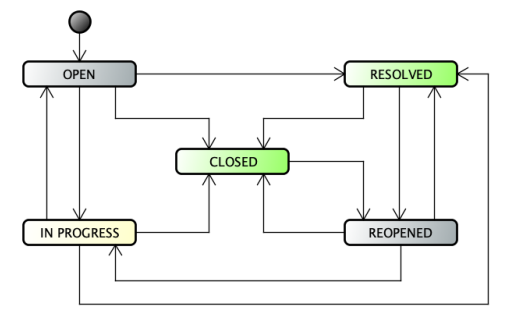
  
Fig. 1 - Fluxo de trabalho de problemas do Jira personalizado

## 3. METODOLOGIA DE COLETA DE DADOS

O conjunto de dados foi construído por meio de um processo de mineração automatizado. Usamos a linguagem de programação Python 3.7.2 para minerar, processar e analisar o conjunto de dados. Todos os dados vieram dos repositórios oficiais Jira5 e Git6 da Apache Software Foundation (ASF). Primeiro, começamos a minerar informações do Jira usando o Jira-Python7, uma biblioteca que facilita a manipulação da API REST do Jira a partir do Python. Nesta etapa, mineramos problemas do tipo “Bug”, com status CLOSED ou RESOLVED, com campo de resolução “Fixed”, e que foram criados e corrigidos entre 2009-01-01 e 2019-01-02.

Para viabilizar o rastreamento entre um relatório de bug e os commits realizados para corrigir esse bug, os desenvolvedores dos projetos da ASF adotam, por padrão, a estratégia de especificar o ID do problema do Jira nas mensagens dos commits dedicados à resolução do problema. Assim, usamos o ID dos problemas para rastrear e minerar as informações de alterações do código-fonte de confirmações que corrigem os bugs usando o Pydriller [13]8. Em seguida, o script cria o primeiro conjunto de dados que chamamos de snapshot. É importante notar que verificamos que há casos em que há apenas uma confirmação, mais de uma confirmação e até mesmo nenhuma confirmação contendo um ID de problema do Jira na mensagem de confirmação. Curiosamente, descobrimos vários casos em que uma confirmação está relacionada a vários relatórios. Portanto, todos esses casos são registrados no conjunto de dados.

Em seguida, usamos os IDs de problemas obtidos para minerar todas as alterações feitas em cada um deles durante o período de tempo considerado, criando o conjunto de dados de log de alterações. Depois disso, para cada ID de problema, mineramos todos os comentários postados no relatório durante o mesmo período de tempo, criando o conjunto de dados de log de comentários. Além disso, usamos os IDs de problemas para minerar todos os commits relacionados, criando um conjunto de dados com informações detalhadas sobre os commits de correção de bugs que chamamos de log de confirmação. Por fim, é importante mencionar que realizamos um pré-processamento em alguns campos de texto do issue (issue summary, description, comments e commit messages) usando a biblioteca Python NLTK9 para extrair e armazenar no dataset as 1.000 palavras mais frequentes e suas respectivas frequências. Todos os scripts usados ​​no processo de mineração e o dataset completo em si podem ser encontrados no pacote de replicação10.

## 4. DESCRIÇÃO DO CONJUNTO DE DADOS

O conjunto de dados é composto por relatórios de bugs de 55 projetos da Apache Software Foundation. Eles são distribuídos em 9 categorias de projetos: big-data (10), banco de dados (8), nuvem (6), servidor de rede (6), estrutura da web (6), segurança (3), gerenciamento de build (4), biblioteca (9) e aprendizado de máquina (3). A lista de nomes de projetos está na Tabela 1, onde são mostrados o nome, a categoria do projeto, o ano do primeiro lançamento e o número de problemas minerados para cada projeto. Coletamos problemas em relação a duas perspectivas: estática e dinâmica.

  <table>
    <caption>
      Tabela 1: Lista de Projetos Alvo
    </caption>
    <thead>
      <tr>
        <th>Category</th>
        <th>Project</th>
        <th>1st Release</th>
        <th>#Bugs</th>
      </tr>
    </thead>
    <tbody>
      <tr>
        <td>
          big-data (10)
        </td>
        <td>
          Hadoop Core  
          Hadoop Yarn  
          Hadoop HDFS  
          Hadoop MapReduce  
          Flink  
          Spark  
          Oozie  
          Kafla  
          Storm  
          Giraph  
        </td>
        <td>
          2006  
          2012  
          2009  
          2009  
          2015  
          2014  
          2012  
          2013  
          2017  
          2018  
        </td>
        <td>
          2861  
          2090  
          3214  
          2210  
          3317  
          6380  
          1420  
          2404  
          1033  
          373  
        </td>
      </tr>
      <tr>
        <td>
          database (8)
        </td>
        <td>
          Hive  
          Cassandra  
          Lucene Core  
          HBase  
          ZooKeeper  
          Derby  
          OpenJPA  
          Phoenix  
        </td>
        <td>
          2010  
          2009  
          2006  
          2006  
          2006  
          2006  
          2006  
          2006  
        </td>
        <td>
          7105  
          5001  
          2004  
          6693  
          882  
          1083  
          653  
          1564  
        </td>
      </tr>
      <tr>
        <td>
          cloud (6)
        </td>
        <td>
          Libcloud  
          jclouds  
          Mesos  
          VCL  
          Helix  
          Ignite  
        </td>
        <td>
          2011  
          2013  
          2013  
          2013  
          2014  
          2015  
        </td>
        <td>
          229  
          435  
          2558  
          425  
          188  
          2726  
        </td>
      </tr>
      <tr>
        <td>
          network-server (6)
        </td>
        <td>
          TomEE  
          Mina  
          Mina FtpServer  
          Mina SSHD  
          Mina Vysper  
          Camel  
        </td>
        <td>
          2013  
          2006  
          2008  
          2009  
          2010  
          2009  
        </td>
        <td>
          713  
          171  
          66  
          285  
          66  
          3232  
        </td>
      </tr>
      <tr>
        <td>
          web-framework (6)
        </td>
        <td>
          MyFaces  
          Struts  
          Nutch  
          Isis  
          Solr  
          Tapestry  
        </td>
        <td>
          2005  
          2002  
          2012  
          2013  
          2006  
          2009  
        </td>
        <td>
          913  
          725  
          547  
          410  
          2249  
          711  
        </td>
      </tr>
      <tr>
        <td>
          security (3)
        </td>
        <td>
          Kerby  
          Fortress  
          Syncope  
        </td>
        <td>
          2006  
          2015  
          2012  
        </td>
        <td>
          179  
          76  
          654  
        </td>
      </tr>
      <tr>
        <td>
          build-management (4)
        </td>
        <td>
          Archiva  
          Ivy  
          MNG  
          Buildr  
        </td>
        <td>
          2007  
          2006  
          2012  
          2009  
        </td>
        <td>
          320  
          204  
          584  
          227  
        </td>
      </tr>
      <tr>
        <td>
          library (9)
        </td>
        <td>
          Commons Compress  
          Commons Colections  
          Commons IO  
          Commons Math  
          Commons Codec  
          Commons LANG  
          Log4J 2  
          Crunch  
          Tika  
        </td>
        <td>
          2009  
          2001  
          2004  
          2004  
          2003  
          2002  
          2014  
          2013  
          2011  
        </td>
        <td>
          189  
          103  
          103  
          418  
          64  
          264  
          754  
          292  
          762  
        </td>
      </tr>
      <tr>
        <td>
          machine-learning (3)
        </td>
        <td>
          SystemML  
          Mahout  
          MADlibr  
        </td>
        <td>
          2017  
          2010  
          2017  
        </td>
        <td>
          489  
          592  
          83  
        </td>
      </tr>
    </tbody>
  </table>

### 4.1 Perspectiva Estática

Na perspectiva estática, coletamos informações da última versão do relatório de bug disponível na ferramenta Jira com status FECHADO ou RESOLVIDO. Para cada relatório de bug, extraímos 53 atributos divididos em 2 grupos principais: os recursos coletados do próprio relatório (atributos Jira) e os coletados do repositório Git (atributos Git). Para fins de organização, também classificamos os campos do conjunto de dados quanto à natureza das informações que eles representam: geral (informações padrão), texto (informações textuais), tempo (informações relacionadas ao tempo), controle de versão (informações relacionadas à versão do sistema), soma (campos que armazenam informações de contagem), link (dependências de bug) e fonte (informações relacionadas ao código-fonte).

A lista completa de campos do conjunto de dados de perspectiva estática (snapshot) pode ser encontrada na Tabela 2. A maioria dos nomes é autoexplicativa, mas em caso de dúvida, a descrição completa do campo pode ser encontrada no site do pacote de replicação.

  <table>
    <caption>Tabela 2: Campos do conjunto de dados estáticos</caption>
    <thead>
      <tr>
        <th>From</th>
        <th>Type</th>
        <th>Field</th>
      </tr>
    </thead>
    <tbody>
      <tr>
        <td>
          Jira (30)
        </td>
        <td>
          <ul>
            <li>General (10)</li>
            <li>Link (2)</li>
            <li>Summation (4)</li>
            <li>Text (3)</li>
            <li>Time (8)</li>
            <li>Versioning (2)</li>
          </ul>
        </td>
        <td>
          <ul>
            <li>Project; Owner; Manager; Category; Key; Priority; Status; Reporter; Assignee; Components</li>
            <li>InwardIssueLinks; OutwardIssueLinks</li>
            <li>NoComments; NoWatchers; NoAttachments; NoAttachedPatches</li>
            <li>SummaryTopWords; DescriptionTopWords; CommentsTopWords</li>
            <li>CreationDate; ResolutionDate; FirstCommentDate; LastCommentDate; FirstAttachmentDate; LastAttachmentDate; FirstAttachedPatchDate; LastAttachedPatchDate</li>
            <li>AffectsVersions; FixVersions</li>
          </ul>
        </td>
      </tr>
      <tr>
        <td>
          Git (24)
        </td>
        <td>
          <ul>
            <li>Text (1)</li>
            <li>Versioning (1)</li>
            <li>Summation (3)</li>
            <li>Time (4)</li>
            <li>Source (15)</li>
          </ul>
        </td>
        <td>
          <ul>
            <li>CommitsMessagesTopWords</li>
            <li>HasMergeCommit</li>
            <li>NoCommits; NoAuthors; NoCommitters</li>
            <li>AuthorsFirstCommitDate; AuthorsLastCommitDate; CommittersFirstCommitDate; CommittersLastCommitDate</li>
            <li>NonSrcAddFiles; NonSrcDelFiles; NonSrcModFiles; NonSrcAddLines; NonSrcDelLines; SrcAddFiles; SrcDelFiles; SrcModFiles; SrcAddLines; SrcDelLines; TestAddFiles; TestDelFiles; TestModFiles; TestAddLines; TestDelLines</li>
          </ul>
        </td>
      </tr>
    </tbody>
  </table>

### 4.2 Perspectiva Dinâmica

Cada relatório de bug começa com algumas informações padrão fornecidas pelo autor. Por exemplo, alguns atributos são sempre criados com o relatório e nunca mudam, como Key (o identificador exclusivo do relatório) e CreationDate. Outros atributos, como Assignee e Priority, são comumente definidos na criação do relatório, mas não são obrigatórios e podem ser alterados durante o tempo de vida do relatório. Alguns outros atributos são difíceis de inserir, a menos que tenha passado um tempo após a criação do relatório. Exemplos são as versões afetadas pelo bug e outros problemas relacionados, uma vez que novas instâncias dessas informações podem surgir mais tarde no processo de reparo do bug. O tipo de atributos de soma está intrinsecamente relacionado ao tempo de vida do relatório, pois o número de comentários, observadores e anexos cresce à medida que o tempo de vida do relatório de bug passa. A perspectiva dinâmica do conjunto de dados representa esses momentos em que o relatório muda, quando novas informações são adicionadas ao relatório ou uma mudança de campo, como: mudança de status; definição ou mudança de prioridade; a escrita de um novo comentário; um novo colaborador começa a observar um problema.

O conjunto de dados dinâmico é composto por três arquivos:

(1) changelog: Este conjunto de dados armazena todas as modificações que já aconteceram em todos os campos de relatórios do Jira. Os campos de dados são mostrados na Tabela 3 e foram extraídos do Jira.

  
Tabela 3: Campos do Changelog

  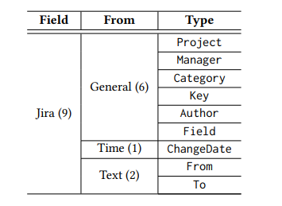

(2) comment-log: Este conjunto de dados armazena informações sobre cada comentário relacionado ao seu relatório. Esses campos de dados, extraídos do Jira, são mostrados na Tabela 4 e foram extraídos do Jira.

  
Tabela 4: Campos do Log de Comentários

  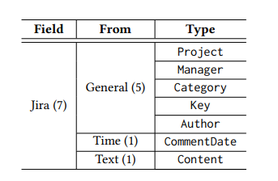

(3) commit-log: Vários relatórios de bugs estão relacionados a algum commit que corrige esse bug. Este conjunto de dados armazena informações de commit relacionadas a cada relatório que tem um. As entradas do conjunto de dados trazem informações detalhadas de cada arquivo modificado por commits de correção de bugs. Os campos de dados são mostrados na Tabela 5.

  
Tabela 5: Campos do log de confirmação

  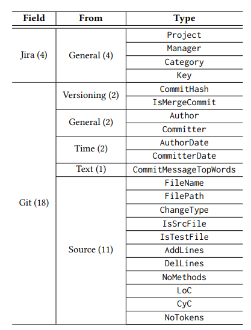

## 5. ANÁLISE DE RELATÓRIOS DE BUGS

Nesta seção, escolhemos três informações de relatórios e tentamos caracterizar o relatório de bug na perspectiva dinâmica: prioridade, cessionário e alterações de status. Também mostramos a distribuição de relatórios por resolução de tempo de bug em oito categorias.

A análise de alterações de relatório de bug é importante, pois pode nos ajudar a entender pontos-chave ao longo do ciclo de vida do relatório de bug. Escolhemos estudar especificamente as alterações de relatórios neste segmento de artigo porque queremos usar este conjunto de dados para propor modelos de aprendizado de máquina para prever o esforço de tempo de correção de bug e prioridade. Mas como criar modelos com um conjunto de amostras mutáveis, ou seja, os relatórios e seus diferentes estados?

No estado inicial de criação do relatório, é normal que um pequeno número de valores de campo sobre o bug esteja disponível, dificultando prever algo sobre ele. Pode-se descobrir sobre o bug, criar o relatório, mas não ter muitas informações sobre sua gravidade ou todas as versões de software em que esse bug aparece, por exemplo. Por outro lado, construir modelos com base no último estado do relatório, ou seja, o momento em que eles são fechados/resolvidos, não é razoável, pois há vários campos descritivos que não estão disponíveis até a resolução do bug. Por exemplo, o número de comentários e anexos pode ser altamente correlacionado com o tempo de esforço de correção (bugs mais complexos podem exigir mais discussão entre os desenvolvedores e mais uploads de patches/anexos). Mas os valores reais para esses campos estão disponíveis apenas no final do ciclo de vida do bug. Uma questão interessante a ser respondida é: qual é o momento no ciclo de vida de um relatório de bug em que se pode dizer que ele contém informações suficientes para prever algo sobre seu futuro com mais confiança, por exemplo, o tempo de esforço de correção, o melhor responsável ou a prioridade real do bug? Acreditamos que o primeiro passo para responder a essa pergunta é entender a natureza das adições e alterações do relatório e seu impacto na tarefa de correção de bugs. Neste segmento, não temos a intenção de propor uma análise exaustiva, mas sim descritiva.

### 5.1 O conjunto de dados do registro de alterações

O conjunto de dados do changelog contém 853.190 entradas referentes a 63 tipos diferentes de alterações. As 15 principais alterações mais comuns estão listadas na Tabela 6. A primeira coluna é o campo onde a alteração ocorreu. A segunda coluna é o número de alterações no tipo específico e o que esse número representa do percentil total de alterações. A terceira coluna é o número de relatórios de bug exclusivos onde o tipo de alteração relacionado ocorreu, já que o mesmo tipo de alteração pode ocorrer no mesmo relatório mais de uma vez.

Algumas coisas merecem destaque ao analisarmos a Tabela 6. Primeiro, é natural que todo relatório tenha alterações de Status e Resolução. Todos eles começam com o status ABERTO e concluem com um status FECHADO ou RESOLVIDO; A mesma coisa com o campo Resolução: ele começa com uma resolução NaN e conclui com uma resolução Fixa. Faz sentido que o campo Status seja onde ocorre o maior número de alterações. O relatório de bug tem vários estados de status intermediários até obter um status FECHADO ou RESOLVIDO. As alterações no campo Assignee são a quinta da lista e estão presentes em quase 55% do relatório. Vale a pena investigar isso porque o Assignee é uma peça fundamental no processo de correção de bugs. Pode-se argumentar que o processo de correção de bugs por si só começa com a definição do Assignee ou quando há algum tipo de resposta (um comentário, uma alteração de um campo, etc.) após a criação do relatório de bugs. É difícil acreditar que o bug será corrigido se ninguém for responsável por ele. Mas como explicar que apenas um pouco mais da metade dos relatórios tem alguma alteração no Assignee? Pode-se argumentar que o Assignee é definido quando o relatório é criado e nunca muda. Ou talvez que o bug seja corrigido por uma pessoa que cria o relatório e nunca foi definida como Assignee no relatório do Jira. O bug pode ser identificado como duplicado ou mesmo que não é um bug antes da etapa de definição do Assignee. Essas questões serão exploradas nas seções a seguir. A última coisa a destacar são as Priority Changes. A prioridade é objeto de estudo em vários artigos relacionados a relatórios de bugs [14] [15] [11] [16]. O número relativamente baixo de alterações (apenas em 14,90% dos relatórios) pode ser uma evidência de que a dica inicial, definida na criação do relatório de bugs, é precisa.

  
Tabela 6: As 15 mudanças mais comuns

  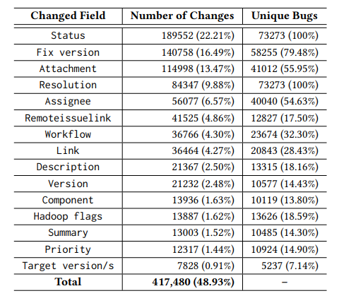

### 5.2 Esforço de correção de bugs

Quanto tempo de esforço é necessário para corrigir um bug específico? Essa é uma questão que foi pesquisada por vários cientistas [19] [1] [6] [22]. Uma vez que essa é uma questão muito importante em relação ao orçamento e aos aspectos de estimativa do próximo lançamento, queremos ver a distribuição do tempo de vida dos bugs em nosso conjunto de dados. Definimos Bug-Fix Effort (BFE) como o intervalo entre CreationDate e ResolutionDate, ou seja, BFE = ResolutionDate - CreationDate. O intervalo usado para agrupar os relatórios por seu tempo de resolução é baseado em [10]. A Tabela 7 mostra a distribuição para oito intervalos BFE. Escolhemos agrupar os projetos por categoria, não individualmente, por questões de espaço. Os significados dos rótulos das colunas são: ‘h’ (hora), ‘d’ (dia) e ‘M’ (mês).

  
Tabela 7: Esforço de correção de bugs

  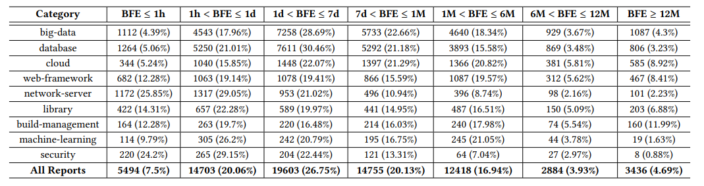

Com base na Tabela 7, é possível ver que o comportamento do esforço de correção de bugs é diferente, dada uma categoria de software, mas a maioria dos bugs (83,88%) são corrigidos entre 1 hora e 6 meses. Há algumas coisas discrepantes, já que 24,2% e 25,85% dos bugs de segurança e de servidor de rede, respectivamente, são corrigidos em menos de uma hora, enquanto em categorias como big data, banco de dados e nuvem, esse valor está entre 4,39% e 5,24%. Essa discrepância também aparece no BFE ≥ 12M, onde o valor para a categoria de gerenciamento de build é 11,99%, enquanto em segurança é menor que 1%.

  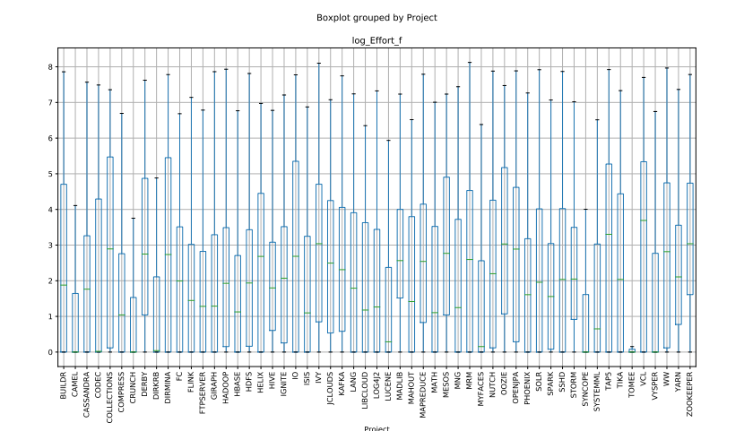
  
Fig. 2 - Log transformado Effort Boxplot por Projeto

As Figuras 2 e 3 mostram o boxplot do esforço transformado em log (para lidar com os dados distorcidos). Os relatórios com esforço menor que uma hora tiveram seus valores truncados para '1'. Os números mostram, mais uma vez, que o comportamento de resolução de esforço dos relatórios é diferente entre categorias e projetos.

  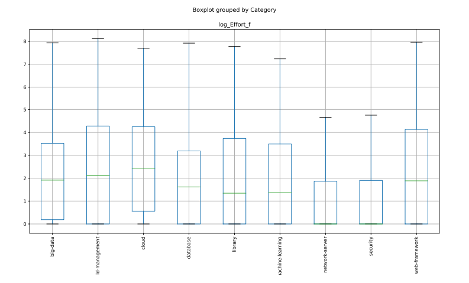
  
Fig. 3 - Log transformado Effort Boxplot por categoria

### 5.3 Mudanças de prioridade

Para executar uma análise das alterações de Prioridade, é necessário definir algumas declarações. Existem cinco valores de prioridade padrão do Jira (em ordem crescente): Trivial, Minor, Major, Critical e Blocker. Mas em um projeto minerado (Cassandra), detectamos mais três valores de prioridade: Low, Normal e Urgent.

A primeira coisa que queremos mostrar é: quão diferente é a distribuição dos valores de prioridade entre quando os relatórios são criados e quando são resolvidos/fechados? Respondemos a essa pergunta na Tabela 8.

  
Tabela 8: Distribuição dos valores de prioridade inicial e final

  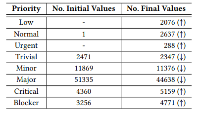

A primeira coisa a notar é que várias alterações estão relacionadas a relatórios que terminam com prioridade "Low", "Normal" e "Urgente". Mas, como apontado antes, esses são tipos de prioridade exclusivos do projeto Cassandra. A soma total das alterações do Cassandra representa 46,30% de todas as alterações de prioridade. Como não podemos definir precisamente o que esses tipos de prioridade exclusivos significam ou qual é seu valor equivalente no conjunto de valores de prioridade padrão do Jira, optamos por remover as alterações de prioridade do projeto Cassandra para fornecer um cenário mais geral. Acreditamos que esses valores únicos são os valores de prioridade padrão do Cassandra e todas, pelo menos a grande quantidade, das mudanças de prioridade representam a adaptação dos valores de status padrão aos valores de prioridade padrão do Cassandra. Essa hipótese faz mais sentido quando verificamos que todos os relatórios do Cassandra têm pelo menos uma mudança de prioridade. A Tabela 9 mostra esse novo cenário sem os relatórios do Cassandra.

Na Tabela 9, vemos que todos os valores de prioridade finais são maiores que os iniciais, exceto o valor "Major". Isso pode indicar que a dica inicial para um relatório com valor de prioridade incerto é o "Major" e, mais tarde, no tempo de vida do relatório, ocorre a definição do valor de prioridade real.

  
Tabela 9: Distribuição dos valores de prioridade inicial e final (sem o Projeto “Cassandra”)

  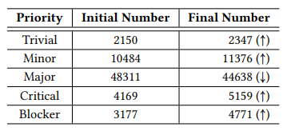

A próxima coisa a verificar é: qual é a distribuição da mudança de prioridade por categorias de software? A resposta está na Tabela 10. A primeira coluna é o nome da categoria. A segunda coluna é o número absoluto de mudanças de prioridade nos relatórios para a categoria fornecida. A terceira coluna representa quanto em percentil o valor na segunda coluna representa em relação ao total de relatórios para a categoria especificada. Na categoria do banco de dados, temos uma particularidade. Os valores com um “*” representam o número sem o projeto “Cassandra”, uma vez que seus valores de prioridade são diferentes em comparação com o padrão e todos os outros valores de prioridade do projeto.

A Tabela 10 mostra que as mudanças de prioridade têm um comportamento particular em diferentes categorias. As mudanças são mais comuns em projetos de big data, rede-servidor, aprendizado de máquina e nuvem.

  
Tabela 10: Número de alterações por categoria.

  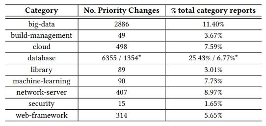

A última coisa que queremos verificar no aspecto das mudanças de prioridade é a frequência delas no mesmo relatório. Em outras palavras, qual é a distribuição de vezes que um determinado relatório muda sua prioridade? Descobrimos que, se houver reatribuição de prioridade em um relatório, essa mudança acontece apenas uma vez em 88,06% dos relatórios, duas vezes em 9,78% e 1,39% mais de duas vezes. Como vemos, a mudança de prioridade não é uma atividade comum.

### 5.4 Alterações do Cessionário

O cessionário é a pessoa responsável por corrigir um determinado bug. Isso é definido pelo gerente de projeto ou pelo próprio desenvolvedor (autoatribuição) e pode ser alterado durante o tempo de vida do relatório. Inicializamos essa análise observando os possíveis cenários relacionados ao cessionário.

- Cenário 1: o relatório é criado sem cessionário, que é definido mais tarde em sua vida útil, antes que o relatório seja resolvido/fechado (35.805 casos). Este cenário pode ser dividido em dois:
  - Cenário 1.a: um cessionário é definido uma vez (29.279 casos).
  - Cenário 1.b: um cessionário é definido mais de uma vez (6.526 casos).
- Cenário 2: o relatório é criado sem cessionário e é concluído sem cessionário também (7.744 casos). Este cenário pode ser dividido em dois:
  - Cenário 2.a: Há pelo menos uma definição de cessionário durante o tempo de vida do relatório (289 casos).
  - Cenário 2.b: Não há atribuição de cessionário durante todo o tempo de vida do relatório. (7.455 casos).
- Cenário 3: o relatório é criado com um cessionário e é concluído com um cessionário também (29.371 casos). Este cenário pode ser dividido em três:
  - Cenário 3.a: Não há alteração de cessionário durante o tempo de vida do relatório (o cessionário inicial é o mesmo que o final) (25.798 casos).
  - Cenário 3.b: Há pelo menos uma alteração de cessionário durante todo o tempo de vida do relatório, mas o inicial é igual ao final (11 casos).
  - Cenário 3.c: Há pelo menos uma alteração de cessionário durante todo o tempo de vida do relatório, e o cessionário inicial é diferente do final (3.562 casos).
- Cenário 4: o relatório é criado com um cessionário e é concluído sem cessionário (373 casos). Este cenário pode ser dividido em dois:
  - Cenário 4.a: Há apenas uma mudança do cessionário original para a definição de “nenhum cessionário” (199 casos).
  - Cenário 4.b: Há mais de uma definição de mudança de cessionário (174 casos).

Mostramos o percentual de relatórios de cada caso na Fig. 4.

  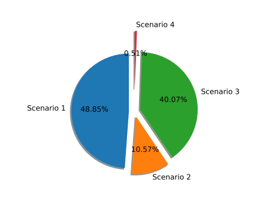
  
Fig. 4 - Cenários de cessionários

A maioria dos relatórios fechados/resolvidos com um cessionário relacionado: os cenários 1 e 3 representam 88,92% dos relatórios. Os cenários 2 e 4 representam 11,08% do total de relatórios, um pequeno número de relatórios que não têm um cessionário relacionado final. Não parece natural que um relatório seja fechado/resolvido sem um cessionário relacionado, exceto em casos em que o relatório é duplicado ou já foi resolvido. Uma investigação para caracterizar esses relatórios pode ajudar a justificar sua existência.

### 5.5 Mudanças de status

As mudanças de status definem em qual fase do ciclo de vida do relatório um relatório de bug está. Como podemos ver na Fig. 1, há um conjunto de status Jira padrão, mas novos podem ser criados para um fluxo de trabalho personalizável. A Tabela 11 lista todos os valores de status que aparecem no campo Status do conjunto de dados. A primeira coluna são os nomes dos campos de status. A segunda e a terceira são os números de ocorrências de um determinado status nos campos From e To do conjunto de dados de perspectiva dinâmica (changelog), respectivamente. Isso significa o número de mudanças de status que tinham originalmente o status específico (From) e o número de mudanças de status que mudaram para o status específico (To). A quarta coluna é o número de projetos que têm pelo menos um relatório que em sua vida útil teve o status fornecido. Também verificamos seis categorias exclusivas relacionadas a dois projetos específicos.

A Tabela 11 mostra que “Open”, “Resolved”, “Closed” e “Re-opened” são os valores de status mais frequentes. Eles estão presentes em todos os projetos do conjunto de dados, sendo um valor “From” ou “To”. Os projetos “MESOS” e “CASSANDRA” têm seus próprios valores de Status exclusivos. Isso provavelmente tem a mesma explicação dos valores exclusivos de prioridade “CASSANDRA”: esses são valores de status de projeto exclusivos que são definidos pelo processo de triagem de bugs da empresa do projeto.

  
Tabela 11: Lista de valores de status.

  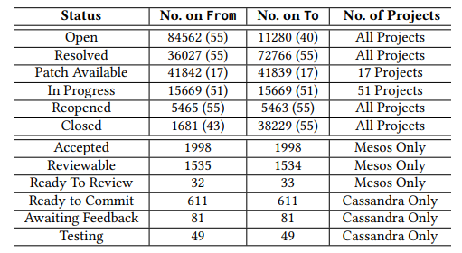

Seja S = {S1 = “Aberto”, S2 = “Resolvido”, S3 = “Patch Disponível”, S4 = “Em Andamento”, S5 = “Reaberto”, S6 = “Fechado”} um conjunto de mudanças de status de todos os projetos. A Tabela 12 mostra a matriz adjacente de mudanças de status. Removemos as ocorrências de valores de status exclusivos dos projetos “Mesos” e “Cassandra” para um cenário mais geral.

Uma análise da Tabela 12 revela o comportamento comum de um relatório de bug.

- Do status “Aberto” (S1), há mudanças em todos os status (incluindo “Aberto” e “Reaberto”), o que é natural, já que “Aberto” pode ser visto como um estado inicial do relatório. Ele vai na maioria para “Patch Disponível” (42,58%) e para “Resolvido” (36,11%), ocasionalmente para “Em Andamento” (14,71%) e “Fechado” (6,53%).
- Do status “Resolvido” (S2), ocasionalmente vai para o status “Reaberto” (9,55%) e geralmente para o status “Fechado” (90,45%).
- De “Patch disponível” (S3), geralmente vai para “Resolvido” (70,20%) (o que pode implicar que o Patch disponível está correto) e ocasionalmente vai para o status “Aberto” (26,27%) ou “Em andamento” (3,43%) (o que pode implicar que o Patch disponível não estava correto/aceito). Há um número (pequeno) de alterações em “Patch disponível”, “Reaberto” e “Fechado”.
- De status “Em andamento” (S4), vai em sua maioria para o status “Resolvido” (57,96%) ou “Patch disponível” (32,11%) e ocasionalmente para o status “Aberto” (4,32%) ou “Fechado” (5,11%).
- Do status “Reaberto” (S5), ele vai em sua maioria (63,49%) para o status “Resolvido”, ocasionalmente para o status “Patch Disponível” (17,41%), “Fechado” (13,29%) ou “Em Andamento” (5,16%).
- Do status “Fechado” (S6), quase todas as mudanças (99,997%) são para o status “Reaberto”, com um pequeno número (0,003%) de mudanças para o status “Resolvido”.

  
Tabela 12: Matriz Adjacente de Mudanças de Status.

  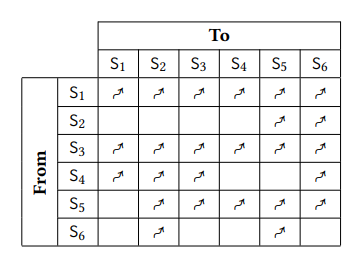

Em seguida, acreditamos que poderia ser um aspecto interessante a ser investigado: qual é a distribuição das mudanças de status nos relatórios? A Fig. 5 mostra essas informações. Para essa visualização, removemos as mudanças de status que registram o mesmo status. Conforme mostrado na Tabela 12, há uma série de mudanças de status que, na verdade, não alteram o status, ou seja, há o registro da mudança de status, mas o status final é igual ao status original. Usamos todos os projetos nessa visualização, pois queremos ver o número de mudanças de status, não o status do estado real. A maioria dos relatórios (73,63%) tem entre 1 a 4 mudanças de status.

  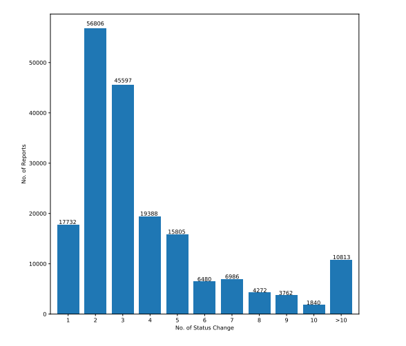
  
Fig. 5 - Nº de alterações de status por nº de relatórios

## 6. RELEVÂNCIA DO CONJUNTO DE DADOS

Nosso conjunto de dados fornece informações sobre a documentação do processo de correção de bugs no ITS. Acreditamos que a relevância do conjunto de dados pode ser justificada por alguns fatores que descrevemos a seguir.

O primeiro fator é o número de projetos (55 projetos), suas diferentes categorias (9 categorias) e datas de lançamento (2003-2017). Essa diversidade pode levar os pesquisadores a encontrar padrões específicos e gerais diferentes no processo de correção de bugs. Existem vários trabalhos que usam relatórios do ITS para entender melhor o processo de correção de bugs. Nosso conjunto de dados proposto pode ser usado para replicar esses estudos e confirmar ou não suas evidências, uma vez que vários deles usam menos projetos para avaliar suas hipóteses [2, 4, 6, 21]. O processo de mineração também não é uma tarefa trivial e disponibilizar o conjunto de dados é um atalho para todos os pesquisadores que desejam entender melhor o processo de triagem e correção de bugs.

O segundo fator é seu aspecto dinâmico (ou seja, as mudanças ocorridas durante a atividade de correção de bugs). Outros trabalhos [5, 20] destacam a relevância das mudanças no relatório, uma vez que não é sensato realizar uma análise conclusiva apenas em um conjunto de instantâneos de relatórios. Como nosso conjunto de dados tem todas as mudanças e novas adições em um relatório, conclusões mais detalhadas e confiáveis ​​podem ser feitas.

## 7. TRABALHOS RELACIONADOS

Há uma série de artigos que propõem conjuntos de dados compostos por relatórios ITS. Nesta seção, discutimos os trabalhos que têm uma abordagem ou objetivo semelhante à nossa proposta.

Lamkanfi, Pérez e Demeye [8] descrevem o processo de mineração para coletar relatórios de defeitos dos sistemas de rastreamento de problemas do Eclipse e do Mozilla. Eles coletaram um total de 46.884 relatórios de bugs de 4 produtos Eclipse (Eclipse Platform, JDT, CDT e PDE) e 168.024 relatórios de bugs de 4 produtos Mozilla (Mozilla Core, Mozilla Firefox, Mozilla Thunderbird e Mozilla Bugzilla). Os autores definem o foco do conjunto de dados nas atualizações ou alterações dos relatórios.

Habayeb et al. [5] propõem um conjunto de dados de defeitos temporais do Firefox com 86.444 relatórios de bugs cobrindo um período de oito anos de 2006 a 2014. O trabalho aponta que, geralmente, as pesquisas têm se concentrado "principalmente na análise da frequência da ocorrência de defeitos e seus atributos". Esta análise simplista não considera o alinhamento temporal de eventos que levam a essas mudanças. Com base em uma análise exploratória realizada no conjunto de dados, os autores sugerem que seus dados minerados podem ser usados ​​para prever propensão a defeitos ou dimensionamento de defeitos e sugerir possíveis correções de defeitos também.

O trabalho apresentado por Ortu et al.[9] é provavelmente o mais semelhante à nossa proposta. O artigo apresenta um conjunto de dados composto por mais de 1K projetos com mais de 700K relatórios de problemas e mais de 2 milhões de comentários dos problemas. Todos os problemas são extraídos do Jira ITS de quatro ecossistemas de código aberto: Apache Software Foundation, Spring, JBoss e CodeHaus. Eles argumentam que usar a quantidade de informações sobre comentários pode levar a análises sentimentais e técnicas. O principal ponto que difere seu banco de dados do nosso é que eles mineraram todos os problemas (não apenas bugs como o nosso) e seu conjunto de dados não fornece informações sobre o gerenciamento de configuração de origem.

O trabalho desenvolvido por Zhu, Zhou e Mei [23] descreve o conjunto de dados minerado sobre o Mozilla Issue Tracking History. O conjunto de dados contém mais de 774.000 problemas relatados de abril de 1998 a janeiro de 2013 e é composto por vários tipos de problemas: defeitos, solicitações de recursos e aprimoramentos, entre outros. O aspecto particular dessa proposta é que ela inclui multiextração (eles recuperam dados de dois canais, um front-end e um back-end, em três momentos diferentes); e um design multinível (o nível 0 são os dados brutos e o nível 1 é um processamento posterior de dados padronizados).

Xu e Zhou [20] apresentam o processo de mineração de conjunto de dados multinível do Linux Kernel Patchwork. Há 665.550 informações de patches extraídas entre dezembro de 2008 e dezembro de 2017 da lista de discussão do Linux Kernel. Eles organizam os dados em 3 níveis: Nível 0, os dados brutos; Nível 1 como dados de estrutura; e Nível 2, como um resultado de processamento posterior. Os autores enfatizam a redução do esforço dos pesquisadores na coleta, limpeza e processamento após iniciativas como essas.

## 8. CONCLUSÃO E TRABALHOS FUTUROS

Neste artigo, propomos um conjunto de dados público composto por relatórios de bugs de 55 projetos da Apache Software Foundation. Descrevemos o processo de mineração e as ferramentas que usamos. Fornecemos um pacote de replicação com o código usado para minerar o relatório. O conjunto de dados é apresentado em duas perspectivas: a estática, composta pelo último instantâneo de estado de cada relatório; e a dinâmica, composta por cada alteração e atualização que ocorre em cada relatório. Também discutimos uma análise de caracterização em quatro características do relatório: o esforço de tempo de correção de bugs, a prioridade, o cessionário e as mudanças de status. Com essas estatísticas simples do conjunto de dados, é possível listar uma série de perguntas sobre o processo de correção de bugs de software de código aberto usando ITS.

Em trabalhos futuros, pretendemos usar este conjunto de dados para investigar vários problemas. Por exemplo, queremos propor uma estimativa probabilística do esforço de correção de tempo de bug. Esta abordagem permite que o gerente de projetos visualize os melhores e piores cenários de tempo de correção de bugs. Como o modelo probabilístico estimará não um único tempo de esforço, mas sim um intervalo de tempo de correção, isso pode levar a sugestões mais cautelosas. Como vemos na Seção V, vários bugs levam mais de um ano para serem corrigidos. O artigo [10] realiza uma análise muito interessante nesses casos. Acreditamos que um estudo de replicação com nossos dados poderia levar a mais evidências sobre casos de bugs de longa duração. A previsão de defeitos de bugs em códigos-fonte e componentes de software é um campo ativo na engenharia de software há alguns anos [17] [12]. Depois de extrair informações de repositórios Git sobre as mudanças no código que corrigem um relatório de bug, acreditamos que misturar essas duas informações pode trazer novas ideias para construir modelos mais complexos e eficientes. As informações do relatório podem ajudar a entender melhor os tipos de bugs e o esforço necessário para corrigi-los.

Disponível em: <a href="https://dl.acm.org/doi/10.1145/3474624.3474627">https://dl.acm.org/doi/abs/10.1145/3345629.3345639</a>.
